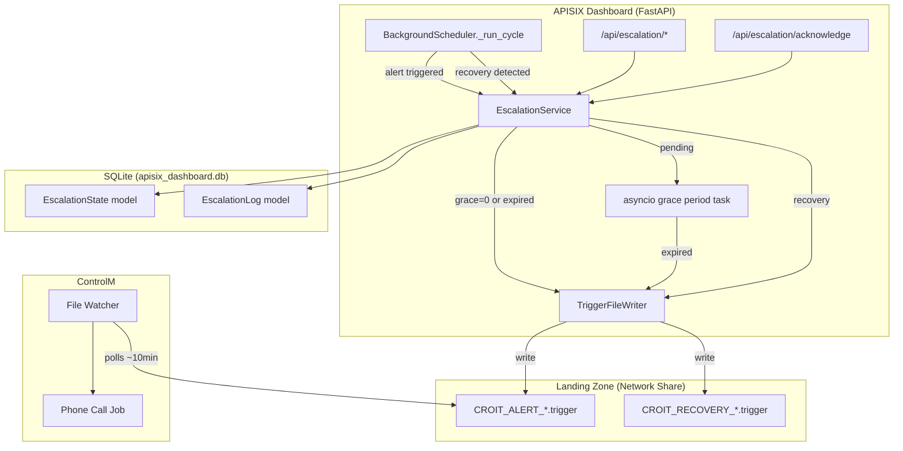

# Design Document: ControlM Escalation

## Overview

This feature adds automated phone-call escalation to the APISIX Dashboard by integrating with the enterprise ControlM scheduling system. When an alert rule triggers (health check failure, upstream error, JWT failure, pod health), the app writes a trigger file to a configurable network share (landing zone) that ControlM's File Watcher detects and uses to initiate phone-call escalation to 1st call / standby IT members.

The design prioritizes **immediate escalation** (0-second grace period) as the default — reflecting the critical nature of the real-time banking infrastructure being monitored (APISIX routes handling live transaction screening via Actimize). Non-critical alert rules can optionally have a grace period during which operators may acknowledge alerts before escalation occurs.

Key design decisions:
- **Async-native** using `asyncio.create_task` for grace period timers (consistent with existing BackgroundScheduler)
- **Service-based architecture** — new `controlm_escalation_service.py` (consistent with existing service pattern)
- **SQLAlchemy ORM models** for escalation state and audit log (consistent with existing models)
- **Atomic file writes** (temp file + rename) to prevent ControlM from detecting partial files
- **Integration into existing BackgroundScheduler** evaluation cycle (no new background thread)

## Architecture



### Integration with Existing BackgroundScheduler

The escalation logic integrates at the **alert trigger and recovery points** inside `BackgroundScheduler._evaluate_rule()`. Currently, when an alert triggers:
1. `trigger_alert(rule, context, db)` is called → sends email

After this feature, when an alert triggers:
1. `trigger_alert(rule, context, db)` is called → sends email (unchanged)
2. `await escalation_service.handle_alert_triggered(rule, context, db)` is called

When recovery is detected:
1. `check_recovery(rule, context, db)` is called → sends recovery email (unchanged)
2. `await escalation_service.handle_recovery(rule, db)` is called

## Components and Interfaces

### 1. EscalationService (`app/services/controlm_escalation_service.py`)

The central coordinator for all escalation logic. Follows the existing service pattern (module-level functions + class singleton).

```python
class EscalationService:
    """Manages escalation lifecycle: decision, grace period, acknowledgment, recovery."""

    def __init__(self):
        self._pending_tasks: dict[int, asyncio.Task] = {}  # rule_id -> grace period task
        self._lock = asyncio.Lock()  # protects _pending_tasks dict

    async def handle_alert_triggered(self, rule: AlertRule, context: AlertContext, db: Session) -> None:
        """Called from BackgroundScheduler when an alert rule triggers."""

    async def handle_recovery(self, rule: AlertRule, db: Session) -> None:
        """Called from BackgroundScheduler when a rule recovers."""

    async def acknowledge(self, rule_id: int, username: str, db: Session) -> tuple[bool, str]:
        """Operator acknowledges a pending escalation. Returns (success, message)."""

    def get_escalation_status(self, rule_id: int, db: Session) -> dict:
        """Returns current escalation state for a single rule."""

    def get_all_statuses(self, db: Session) -> dict[int, dict]:
        """Returns escalation states for all rules (batch for dashboard)."""

    async def restore_state_on_startup(self) -> None:
        """Load persisted escalation state from DB, restart pending grace periods."""

    async def _start_grace_period(self, rule: AlertRule, context: AlertContext, db: Session) -> None:
        """Start an asyncio task for the grace period countdown."""

    async def _on_grace_period_expired(self, rule_id: int) -> None:
        """Grace period expired — write trigger file."""

    async def _escalate_immediately(self, rule: AlertRule, context: AlertContext, db: Session) -> None:
        """Write trigger file immediately (critical or grace=0)."""

    async def _cancel_pending(self, rule_id: int, reason: str, db: Session) -> None:
        """Cancel a pending grace period task."""

    def _get_effective_grace_period(self, rule: AlertRule, db: Session) -> int:
        """Returns 0 if critical flag set, otherwise global grace_period setting."""
```

### 2. TriggerFileWriter (`app/services/controlm_trigger_writer.py`)

Handles all file system interactions with the landing zone. Kept separate from escalation logic for testability.

```python
class TriggerFileWriter:
    """Writes trigger and recovery files atomically to the landing zone."""

    def write_trigger_file(self, rule: AlertRule, context: AlertContext, timestamp: datetime) -> tuple[bool, str]:
        """Write a trigger file. Returns (success, file_path_or_error)."""

    def write_recovery_file(self, rule: AlertRule, timestamp: datetime) -> tuple[bool, str]:
        """Write a recovery file. Returns (success, file_path_or_error)."""

    @staticmethod
    def sanitize_name(name: str) -> str:
        """Replace non-alphanumeric chars (except _) with _, truncate to 100 chars."""

    @staticmethod
    def format_file_content(rule: AlertRule, context: AlertContext, timestamp: datetime) -> str:
        """Generate KEY=VALUE content for the trigger file."""

    def _get_landing_zone(self, db: Session) -> str:
        """Read landing_zone path from controlm_settings table."""

    def _atomic_write(self, landing_zone: str, filename: str, content: str) -> None:
        """Write to temp file then os.rename to final path."""
```

### 3. API Router (`app/routers/escalation.py`)

New router file following existing patterns (Depends for auth, Depends for db session).

| Method | Path | Auth | Description |
|--------|------|------|-------------|
| `GET` | `/escalation/settings` | admin | Get current ControlM escalation settings |
| `PUT` | `/escalation/settings` | admin | Update landing zone, grace period, global toggle |
| `POST` | `/escalation/acknowledge/{rule_id}` | admin, viewer | Acknowledge pending escalation |
| `GET` | `/escalation/status` | admin, viewer | Get all rule escalation statuses |
| `GET` | `/escalation/status/{rule_id}` | admin, viewer | Get single rule escalation status |
| `GET` | `/escalation/history` | admin, viewer | Query escalation audit log (filtered) |

#### Settings Payload (PUT /escalation/settings)

```json
{
  "controlm_enabled": true,
  "landing_zone": "/mnt/landing_zone/mft/prod/incoming/croit/escalation/",
  "grace_period": 0
}
```

#### Acknowledge Response (POST /escalation/acknowledge/{rule_id})

```json
{
  "success": true,
  "message": "Escalation acknowledged and cancelled for rule 'RTS Health Check'"
}
```

#### Status Response (GET /escalation/status)

```json
{
  "statuses": {
    "5": {
      "state": "escalated_critical",
      "escalated_at": "2026-06-15T08:30:00Z",
      "trigger_file": "CROIT_ALERT_RTS_Health_Check_20260615_083000.trigger"
    },
    "12": {
      "state": "pending",
      "grace_remaining_seconds": 145,
      "grace_started_at": "2026-06-15T08:32:00Z"
    }
  }
}
```

### 4. Frontend Components (React)

#### Settings Page Addition (`src/pages/Settings.jsx`)
- New "ControlM Escalation" section (admin only)
- Fields: Global Enable toggle, Landing Zone path input, Grace Period input
- Uses existing `apiClient` for API calls

#### Notifications Page Enhancement (`src/pages/Notifications.jsx`)
- Add `notify_controlm` and `critical` toggles to alert rule create/edit form
- Add escalation status badge next to each rule row
- Add "Acknowledge" button for pending non-critical rules

#### New Component (`src/components/EscalationBadge.jsx`)
- Color-coded badge: Yellow pulsing (pending), Red (escalated), Red + ⚡ (critical)
- MM:SS countdown timer for pending escalations

#### New Component (`src/components/EscalationHistory.jsx`)
- Table: Timestamp, Rule, Event Type, Details, User
- Filters: Rule name, date range
- Accessible from Notifications page

## Data Models

### New Model: `EscalationState` (`app/models/escalation_state.py`)

```python
class EscalationState(Base):
    __tablename__ = "escalation_state"

    rule_id = Column(Integer, ForeignKey("alert_rules.id", ondelete="CASCADE"), primary_key=True)
    state = Column(String(20), nullable=False, default="idle")  # idle, pending, escalated
    grace_started_at = Column(DateTime, nullable=True)
    grace_expires_at = Column(DateTime, nullable=True)
    escalated_at = Column(DateTime, nullable=True)
    trigger_file = Column(String(500), nullable=True)
    failure_message = Column(Text, nullable=True)
```

### New Model: `EscalationLog` (`app/models/escalation_log.py`)

```python
class EscalationLog(Base):
    __tablename__ = "escalation_logs"

    id = Column(Integer, primary_key=True, index=True)
    rule_id = Column(Integer, ForeignKey("alert_rules.id", ondelete="SET NULL"), nullable=True)
    rule_name = Column(String(200), nullable=False)
    event_type = Column(String(30), nullable=False)
    # event_types: trigger_file_written, trigger_file_failed,
    #              acknowledged, grace_period_expired,
    #              recovery_file_written, recovery_cancelled_pending
    file_path = Column(String(500), nullable=True)
    username = Column(String(128), nullable=True)
    error_msg = Column(Text, nullable=True)
    created_at = Column(DateTime, default=lambda: datetime.now(timezone.utc), nullable=False)

    __table_args__ = (
        Index("ix_escalation_logs_rule_time", "rule_id", "created_at"),
        Index("ix_escalation_logs_time", "created_at"),
    )
```

### Column Additions to `AlertRule` Model

```python
# Add to alert_rules table:
notify_controlm = Column(Boolean, default=False, nullable=False)
critical = Column(Boolean, default=False, nullable=False)
```

### New Model: `ControlMSettings` (`app/models/controlm_settings.py`)

```python
class ControlMSettings(Base):
    __tablename__ = "controlm_settings"

    id = Column(Integer, primary_key=True, default=1)  # singleton row
    controlm_enabled = Column(Boolean, default=False, nullable=False)
    landing_zone = Column(String(500), default="", nullable=False)
    grace_period = Column(Integer, default=0, nullable=False)  # seconds
    updated_at = Column(DateTime, default=lambda: datetime.now(timezone.utc), nullable=False)
```

### Critical Rule Pattern Matching

```python
CRITICAL_PATTERNS = [
    'realtimewsprovider',
    'realtimescreening',
    'rts',
    'actimize',
    'actone',
    'rcm',
]
```

Matching is case-insensitive against both `route_name` and `route_id` fields of the alert rule.

## Correctness Properties

### Property 1: Escalation Decision Correctness

*For any* alert rule configuration (notify_controlm, critical flag, global toggle) and alert trigger event, the escalation decision SHALL be:
- No action if `notify_controlm` is disabled OR global toggle is disabled
- Immediate trigger file write if effective grace period is 0 (critical=true OR global grace_period=0)
- Start pending grace period countdown if effective grace period > 0

**Validates: Requirements 1.1, 2.4, 2.6, 3.1, 3.2, 3.3**

### Property 2: Trigger File Name Format

*For any* rule name string and UTC timestamp, the generated trigger filename SHALL:
- Match the pattern `CROIT_ALERT_{sanitized_name}_{YYYYMMDD_HHMMSS}.trigger`
- Where `sanitized_name` contains only characters matching `[a-zA-Z0-9_]`
- Where `sanitized_name` length is at most 100 characters
- Where `sanitized_name` is `UNKNOWN` if all original characters were non-alphanumeric

**Validates: Requirements 1.2, 1.6, 1.7**

### Property 3: Trigger File Content Format

*For any* rule data (name, route_id, route_name, condition_type, failure_message, critical flag) and timestamp, the generated trigger file content SHALL:
- Contain exactly the keys: `rule_name`, `route_id`, `route_name`, `condition_type`, `failure_message`, `alert_timestamp`, `severity`
- Have one KEY=VALUE pair per line
- Have `failure_message` value truncated to at most 500 characters
- Have `alert_timestamp` in ISO 8601 UTC format
- Have `severity` equal to `CRITICAL` if critical flag is true, else `WARNING`

**Validates: Requirements 1.3**

### Property 4: Settings Input Validation

*For any* input value, the settings validation SHALL:
- Accept landing zone paths with length between 1 and 500 characters (inclusive)
- Reject empty strings and strings longer than 500 characters for landing zone
- Accept integer grace period values between 0 and 86400 (inclusive)
- Reject non-integer or out-of-range grace period values

**Validates: Requirements 2.1, 2.2, 2.8, 2.9**

### Property 5: Settings Persistence Round-Trip

*For any* valid ControlM settings (landing_zone, grace_period, controlm_enabled), saving the settings and then reading them back SHALL return the same values.

**Validates: Requirements 2.5**

### Property 6: Critical Flag Overrides Grace Period

*For any* alert rule with `critical=true` and *any* global grace period value (0-86400), the effective grace period SHALL always be 0.

**Validates: Requirements 2.10**

### Property 7: Critical Flag Default from Pattern Matching

*For any* alert rule whose route_name or route_id contains (case-insensitive) one of the known real-time screening patterns, the default `critical` flag SHALL be `true`. For names/IDs not matching any pattern, the default SHALL be `false`.

**Validates: Requirements 2.11**

### Property 8: Authorization Enforcement

*For any* user with a role other than `admin`, requests to modify ControlM escalation settings SHALL be rejected with a permission error.

**Validates: Requirements 2.7**

### Property 9: Cancellation of Pending Escalation

*For any* alert rule with an active pending escalation (grace period countdown running), either an operator acknowledgment OR a recovery event SHALL cancel the pending escalation — removing the pending state and preventing trigger file write.

**Validates: Requirements 3.4, 3.7**

### Property 10: Acknowledgment Rejection When Not Applicable

*For any* alert rule that does NOT have an active pending escalation (either already escalated, idle, or effective grace period is 0), an acknowledgment request SHALL be rejected with an appropriate error message.

**Validates: Requirements 3.9**

### Property 11: One Active Escalation Per Rule

*For any* alert rule that already has an active escalation cycle (pending or escalated), a subsequent alert trigger SHALL NOT start a new escalation cycle or write a duplicate trigger file.

**Validates: Requirements 3.10, 4.3**

### Property 12: Escalation State Persistence Round-Trip

*For any* escalation state (idle, pending, escalated) with associated metadata, persisting the state to the database and reading it back SHALL return an equivalent state.

**Validates: Requirements 4.4**

### Property 13: Recovery File Generation

*For any* alert rule that has been escalated (trigger file written) and then recovers, a recovery file SHALL be written with the name format `CROIT_RECOVERY_{sanitized_name}_{YYYYMMDD_HHMMSS}.trigger` using the same sanitization rules as trigger files.

**Validates: Requirements 4.1**

### Property 14: Audit Log Creation

*For any* escalation event (trigger_file_written, acknowledged, grace_period_expired, trigger_file_failed, recovery_file_written), the system SHALL create a corresponding entry in the escalation log with the correct event_type, rule_name, and timestamp.

**Validates: Requirements 5.1, 5.2, 5.3, 5.5, 5.6**

### Property 15: Audit History Query Correctness

*For any* combination of filter parameters (rule_name, start_date, end_date), the escalation history query SHALL return only matching records, limited to a maximum of 1000, sorted by timestamp descending.

**Validates: Requirements 5.4**

### Property 16: Escalation Status Indicator Derivation

*For any* alert rule with `notify_controlm` enabled, the escalation status indicator SHALL be:
- No indicator when state is `idle` and rule is not triggered
- "Pending Escalation" with remaining MM:SS when state is `pending`
- "Escalated" when state is `escalated` and `critical` is false
- "Escalated (Critical)" when state is `escalated` and `critical` is true
- No indicator when `notify_controlm` is disabled

**Validates: Requirements 6.1, 6.2, 6.3, 6.4, 6.5**

### Property 17: Remaining Time MM:SS Formatting

*For any* integer number of remaining seconds (0-86400), the formatted display string SHALL be in `MM:SS` format where MM is zero-padded minutes and SS is zero-padded seconds.

**Validates: Requirements 6.2**

## Error Handling

### Landing Zone Unreachable

| Scenario | Behavior |
|----------|----------|
| Path doesn't exist | Log error, record `trigger_file_failed` audit entry |
| Path exists but not writable | Log error, record `trigger_file_failed` audit entry |
| Write succeeds but rename fails | Clean up temp file, log error, record failure |
| Recovery file write fails | Log error, retry on next evaluation cycle |

The system MUST NOT crash or block the evaluation cycle due to file system errors. All file operations are wrapped in try/except with appropriate logging.

### Async Safety

| Resource | Protection |
|----------|-----------|
| `_pending_tasks` dict | `asyncio.Lock` (single event loop — no threading needed) |
| SQLAlchemy sessions | New session per operation (via `SessionLocal()`) |
| File system writes | No lock needed (unique filenames per event) |

**Key difference from threading**: Since the BackgroundScheduler runs on a single asyncio event loop, we use `asyncio.Lock` instead of `threading.Lock`. Grace period tasks are `asyncio.Task` objects that can be cancelled cleanly.

### Startup Recovery

On application startup (in FastAPI lifespan):
1. Alembic migrations create the new tables (or `Base.metadata.create_all` for SQLite)
2. `await escalation_service.restore_state_on_startup()` is called in the lifespan startup
3. For rules in `pending` state: check if grace period has already expired → if yes, escalate immediately; if no, start a new asyncio task for the remaining time
4. For rules in `escalated` state: keep state as-is (prevents duplicate trigger files)

### Input Validation

| Input | Validation | Error Response |
|-------|-----------|----------------|
| Landing zone path | Non-empty, 1-500 chars | 400 + descriptive message |
| Grace period | Integer, 0-86400 | 400 + descriptive message |
| Rule ID (acknowledge) | Must exist, must have pending state | 404 or 409 + descriptive message |
| History date range | Valid ISO 8601 | 400 + "Invalid date format" |

## Testing Strategy

### Property-Based Testing (Hypothesis)

Components suited for PBT (pure logic, clear contracts):
- **Trigger file name generation** (sanitization + format)
- **Trigger file content generation** (KEY=VALUE format, truncation)
- **Settings validation** (accept/reject based on constraints)
- **Escalation decision logic** (given config → expected action)
- **Status indicator derivation** (given state → expected display)
- **MM:SS time formatting**
- **Critical flag pattern matching**

**Library**: `hypothesis` (already used in PROD/backend tests)
**Test file**: `tests/test_controlm_escalation.py`

### Integration Tests (pytest + httpx.AsyncClient)

- Full escalation cycle: trigger → trigger file → recovery file (with mock filesystem)
- Grace period flow: trigger → pending → expire → trigger file
- Acknowledgment flow: trigger → pending → acknowledge → cancelled
- Settings CRUD with auth enforcement
- App restart recovery: persist state → restart → verify tasks restored

### What NOT to Property-Test

- Actual file system writes (mock `os.rename` in integration tests)
- Timer accuracy (asyncio scheduling is best-effort)
- React component rendering (use React testing if needed)
- ControlM File Watcher behavior (external system)
