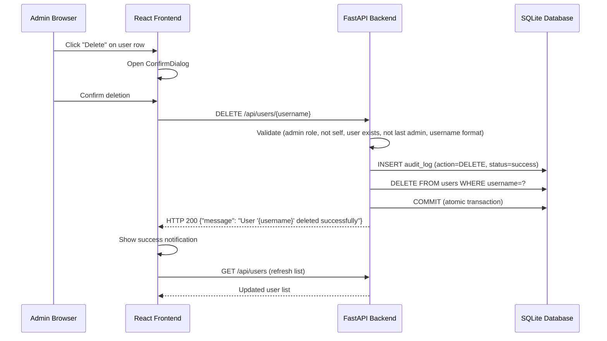
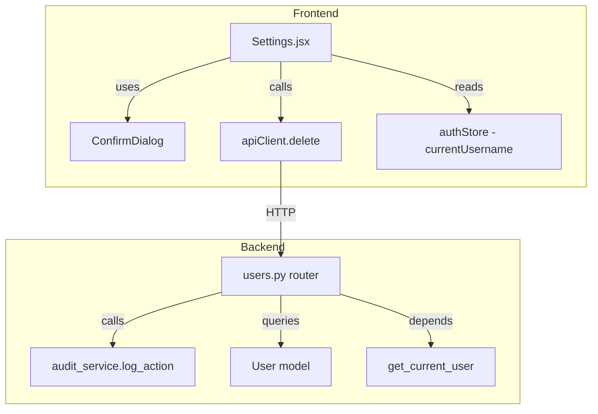

# Design Document: Delete User Management

## Overview

This design adds a "Delete User" capability to the APISIX Dashboard Settings tab, allowing admins to permanently remove user accounts. The feature spans a new backend API endpoint (`DELETE /users/{username}`), integration with the existing audit logging system, and frontend UI changes to the Settings page user table.

The design builds directly on the existing patterns in the codebase: the `users.py` router for the endpoint, the `audit_service.py` for logging, the `ConfirmDialog` component for confirmation, and the Zustand auth store for current-user awareness.

**Key Design Decisions:**
- **Hard delete** (not soft-delete) — the user record is permanently removed from the `users` table. The audit log preserves the historical record of who was deleted and by whom.
- **Implicit session invalidation** — when a user is deleted, their row is gone. The existing `get_current_user` dependency already returns 401 when the user row doesn't exist, so deleted users are immediately locked out without any extra token blacklist entries.
- **No database schema changes** — the existing `users` and `audit_log` tables already have the columns needed. No migrations required.

## Architecture



### Component Interaction



## Components and Interfaces

### Backend: New DELETE Endpoint

**Location:** `app/routers/users.py`

**Endpoint:** `DELETE /users/{username}`

**Interface:**

```python
@router.delete("/users/{username}")
def delete_user(
    username: str,
    request: Request,
    current_user: User = Depends(get_current_user),
    db: Session = Depends(get_db),
) -> dict:
    """Permanently delete a user account. Admin only."""
```

**Request:**
- Path parameter: `username` (string, validated with regex `^[a-zA-Z0-9._-]{1,128}$`)
- Header: `Authorization: Bearer <token>`

**Response (200):**
```json
{"message": "User '{username}' deleted successfully"}
```

**Error Responses:**
| Status | Condition | Body |
|--------|-----------|------|
| 400 | Self-deletion attempt | `{"detail": "Cannot delete your own account"}` |
| 400 | Last admin | `{"detail": "Cannot delete the last admin user"}` |
| 400 | Invalid username format | `{"detail": "Invalid username format"}` |
| 403 | Non-admin caller | `{"detail": "Admin access required"}` |
| 404 | User not found | `{"detail": "User '{username}' not found"}` |

**Guard Logic (evaluation order):**
1. Verify caller has `admin` role
2. Validate `username` format (alphanumeric + hyphens + underscores + periods, max 128 chars)
3. Check `username != current_user.username` (no self-delete)
4. Query user from DB — 404 if not found
5. If target user is admin, count remaining active admins — reject if count ≤ 1
6. Log audit entry (success), delete user, invalidate sessions

### Backend: Session Invalidation

When a user is deleted, any tokens they hold become invalid. The system uses a username-based blacklist entry:

```python
# Insert a blacklist entry for the deleted user's JTI prefix
# This is a "user-level invalidation" — verify_token already checks blacklist
blacklist_entry = TokenBlacklist(
    jti=f"deleted_user:{username}",
    expires_at=datetime.now(timezone.utc) + timedelta(minutes=settings.JWT_EXPIRY_MINUTES),
)
db.add(blacklist_entry)
```

**Alternative approach (chosen):** Instead of a prefix convention, add a check in `get_current_user` — after decoding the JWT and looking up the user, if the user no longer exists in the DB, the dependency already returns 401. This is the simpler, already-existing mechanism. The `get_current_user` function already does:

```python
user = db.query(User).filter(User.username == username, User.is_active == True).first()
if user is None:
    raise HTTPException(status_code=401, detail="Not authenticated")
```

**Decision:** Rely on the existing `get_current_user` dependency. Once the user row is deleted, any subsequent request with their JWT will fail at the `user is None` check. No additional token blacklist entry is needed for session invalidation — it is inherently handled by the hard delete.

### Backend: Audit Logging Integration

Two audit entries are written:

1. **On success** — before committing the delete:
```python
audit_service.log_action(
    db=db,
    username=current_user.username,
    action="DELETE",
    resource_type="users",
    resource_id=target_username,
    details=None,
    ip_address=client_ip,
    status="success",
)
```

2. **On guard rejection** — when a guard condition prevents deletion:
```python
audit_service.log_action(
    db=db,
    username=current_user.username,
    action="DELETE",
    resource_type="users",
    resource_id=target_username,
    details=rejection_reason,
    ip_address=client_ip,
    status="failed",
)
```

**Note:** The audit entry is committed before the HTTP response is returned, satisfying requirement 2.3. Since SQLite is single-writer and the audit `log_action` calls `db.commit()`, the entry is persisted before the response. However, to ensure atomicity with the delete itself, both the audit log insert and the user delete will be done in a single transaction (removing the intermediate commit from `log_action` for this operation and committing once at the end).

**Revised approach:** Inline the audit log creation (without calling `log_action` which auto-commits) so that the audit entry and user deletion share a single `db.commit()`. This ensures the audit record exists if and only if the delete succeeded.

### Frontend: Settings.jsx Changes

**New state:**
```javascript
const [deleteTarget, setDeleteTarget] = useState(null);  // username being deleted
const [deleting, setDeleting] = useState(false);          // loading state for delete
```

**New handler:**
```javascript
async function handleDeleteUser(username) {
  setDeleting(true);
  setError('');
  setSuccess('');
  try {
    const response = await apiClient.delete(`/users/${username}`, { timeout: 30000 });
    setSuccess(`User '${username}' deleted successfully`);
    fetchUsers();
  } catch (err) {
    if (err.code === 'ECONNABORTED') {
      setError('Request timed out. Please try again.');
    } else {
      setError(err.response?.data?.detail || 'Failed to delete user');
    }
  } finally {
    setDeleting(false);
    setDeleteTarget(null);
  }
}
```

**Delete button** — rendered for each user row where `user.username !== currentUsername`:
```jsx
<button
  onClick={() => setDeleteTarget(user.username)}
  className="px-3 py-1.5 text-xs font-medium rounded-md bg-red-50 text-red-700 hover:bg-red-100 transition-colors"
>
  Delete
</button>
```

**ConfirmDialog integration:**
```jsx
<ConfirmDialog
  open={deleteTarget !== null}
  title="Delete User"
  message={`Are you sure you want to permanently delete user '${deleteTarget}'? This action cannot be undone.`}
  confirmLabel="Delete"
  cancelLabel="Cancel"
  variant="danger"
  onConfirm={() => handleDeleteUser(deleteTarget)}
  onCancel={() => setDeleteTarget(null)}
/>
```

**Notification behavior:**
- Success: green notification, auto-dismiss after 5 seconds via `setTimeout`
- Error: red notification, persists until manually dismissed (close button added)
- Loading: confirm button disabled + spinner while request is in flight

### Frontend: ConfirmDialog Enhancement

The existing `ConfirmDialog` component already supports all needed props (`open`, `title`, `message`, `confirmLabel`, `onConfirm`, `onCancel`, `variant`). A minor enhancement adds a `disabled` prop to the confirm button for the loading state:

```jsx
// Add to ConfirmDialog props:
disabled = false  // when true, confirm button shows spinner and is non-clickable
```

## Data Models

### Existing Models (No Schema Changes)

**User (`users` table):**
| Column | Type | Notes |
|--------|------|-------|
| id | INTEGER PK | Auto-increment |
| username | VARCHAR(64) | Unique, indexed |
| hashed_password | VARCHAR(128) | |
| role | VARCHAR(16) | `admin` or `viewer` |
| is_active | BOOLEAN | |
| created_at | DATETIME | UTC |

**AuditLog (`audit_log` table):**
| Column | Type | Notes |
|--------|------|-------|
| id | INTEGER PK | |
| timestamp | DATETIME | UTC |
| username | VARCHAR(100) | Actor (the admin who performed delete) |
| action | VARCHAR(50) | `DELETE` for this feature |
| resource_type | VARCHAR(50) | `users` |
| resource_id | VARCHAR(200) | Deleted username |
| details | TEXT | Rejection reason (for failed attempts) |
| ip_address | VARCHAR(50) | Client IP |
| status | VARCHAR(20) | `success` or `failed` |

**TokenBlacklist (`token_blacklist` table):**
Not used for this feature — session invalidation is handled implicitly by the user row deletion (see Architecture section).

### Username Validation

The username path parameter is validated against the regex pattern:
```
^[a-zA-Z0-9._-]{1,128}$
```

This allows alphanumeric characters, periods, underscores, and hyphens, with a maximum length of 128 characters. This matches the existing `username` column constraint of `String(64)` in the model (the 128-char limit in the requirement is more permissive than the DB column, but validation catches overly long names before they reach the DB).


## Correctness Properties

*A property is a characteristic or behavior that should hold true across all valid executions of a system — essentially, a formal statement about what the system should do. Properties serve as the bridge between human-readable specifications and machine-verifiable correctness guarantees.*

### Property 1: Successful delete removes user and records audit

*For any* valid admin user and any existing target user (where target ≠ caller and target is not the sole remaining admin), issuing a DELETE request SHALL remove the target from the database, return HTTP 200 with the message "User '{username}' deleted successfully", and create an audit log entry with action="DELETE", resource_type="users", resource_id=target username, status="success", and the caller's username as actor.

**Validates: Requirements 1.1, 2.1, 2.3**

### Property 2: Non-admin users are always rejected

*For any* authenticated user whose role is not "admin" and any target username, a DELETE request to `/users/{username}` SHALL return HTTP 403 with the message "Admin access required", regardless of whether the target user exists.

**Validates: Requirements 1.2**

### Property 3: Non-existent usernames return 404

*For any* valid-format username that does not exist in the database, a DELETE request from an admin user SHALL return HTTP 404 with the message "User '{username}' not found".

**Validates: Requirements 1.3**

### Property 4: Self-deletion is always rejected

*For any* admin user, a DELETE request targeting their own username SHALL return HTTP 400 with the message "Cannot delete your own account".

**Validates: Requirements 1.4**

### Property 5: Last admin protection

*For any* system state where a target user is the only active admin, a DELETE request targeting that user SHALL return HTTP 400 with the message "Cannot delete the last admin user".

**Validates: Requirements 1.5**

### Property 6: Invalid username format rejection

*For any* string that contains characters outside the set `[a-zA-Z0-9._-]` or exceeds 128 characters in length, a DELETE request with that string as the username path parameter SHALL return HTTP 400 with an error message indicating invalid username format.

**Validates: Requirements 1.6**

### Property 7: All guard rejections produce failed audit entries

*For any* DELETE request that is rejected due to a guard condition (self-delete, last admin, user not found, invalid format), the system SHALL record an audit log entry with action="DELETE", resource_type="users", resource_id=target username, status="failed", the caller's username as actor, and details containing the rejection reason.

**Validates: Requirements 2.2, 2.3**

## Error Handling

### Backend Error Handling

| Scenario | HTTP Status | Response | Recovery |
|----------|-------------|----------|----------|
| Non-admin caller | 403 | `{"detail": "Admin access required"}` | Caller needs admin role |
| Invalid username format | 400 | `{"detail": "Invalid username format"}` | Fix username input |
| Self-deletion attempt | 400 | `{"detail": "Cannot delete your own account"}` | Cannot delete yourself |
| User not found | 404 | `{"detail": "User '{username}' not found"}` | User may already be deleted |
| Last admin protection | 400 | `{"detail": "Cannot delete the last admin user"}` | Promote another user to admin first |
| Database error | 500 | `{"detail": "Internal server error"}` | Retry; check logs |

**Transaction safety:** The delete operation and audit log insert share a single database transaction. If either fails, both are rolled back — no partial state (deleted user without audit, or audit without deletion).

**Guard evaluation order** matters for correct error messages:
1. Admin role check (403) — cheapest, no DB query
2. Username format validation (400) — regex check, no DB query
3. Self-delete check (400) — compare strings, no DB query
4. User existence check (404) — single DB query
5. Last admin check (400) — conditional DB count query

### Frontend Error Handling

| Scenario | User Experience |
|----------|----------------|
| API returns error with `detail` | Red notification with the detail message, persists until dismissed |
| API returns error without `detail` | Red notification: "Failed to delete user", persists until dismissed |
| Request times out (30s) | Red notification: "Request timed out. Please try again.", confirm button re-enabled |
| Network error | Red notification: "Network error. Check your connection.", persists until dismissed |
| 401 during delete | Axios interceptor clears auth → redirect to login (existing behavior) |

**Loading state:** While the DELETE request is in flight, the ConfirmDialog's confirm button is disabled and shows a spinner. This prevents double-submission.

## Testing Strategy

### Property-Based Tests (Hypothesis)

The backend logic is ideal for property-based testing — it's a pure function of (current_user, target_username, database_state) → (response, side_effects). Using the existing `hypothesis` library already in the project.

**Library:** `hypothesis` (already a project dependency, used in `test_auth_properties.py`, `test_proxy_properties.py`, etc.)

**Configuration:** Minimum 100 iterations per property test.

**Tag format:** `# Feature: delete-user-management, Property {N}: {title}`

**Test file:** `tests/test_delete_user_properties.py`

Each correctness property maps to a single property-based test:

| Property | Test | Generator Strategy |
|----------|------|-------------------|
| 1: Successful delete + audit | `test_successful_delete_removes_user_and_audits` | Random valid usernames, random roles for target |
| 2: Non-admin rejection | `test_non_admin_always_rejected` | Random viewer users, random target usernames |
| 3: Non-existent user 404 | `test_nonexistent_user_returns_404` | Random valid-format usernames not seeded in DB |
| 4: Self-delete rejection | `test_self_delete_always_rejected` | Random admin usernames |
| 5: Last admin protection | `test_last_admin_cannot_be_deleted` | Single admin + viewer caller scenario |
| 6: Invalid format rejection | `test_invalid_username_format_rejected` | Random strings with special chars, long strings |
| 7: Guard rejections audit | `test_all_rejections_produce_audit_entries` | Mix of rejection scenarios |

### Unit Tests (pytest)

Example-based tests for specific scenarios and UI-adjacent logic:

- Delete button visibility (not on current user row)
- ConfirmDialog content matches expected text
- Success notification auto-dismiss timing
- Error notification persistence
- Loading state disables confirm button
- Timeout handling (30s)

### Integration Tests

- End-to-end delete flow: login as admin → create user → delete user → verify user gone
- Audit log query after deletion shows correct entry
- Deleted user's token no longer authenticates (implicit session invalidation)

### Test Infrastructure

Tests use the existing `conftest.py` pattern:
- In-memory SQLite for isolation
- `TestClient` from FastAPI for HTTP-level testing
- Fresh database per test function
- Hypothesis settings: `max_examples=100`, `suppress_health_check=[HealthCheck.too_slow]`
