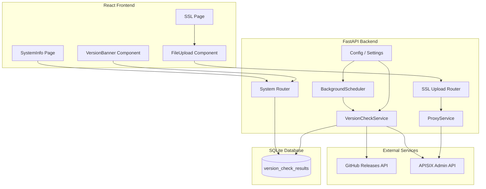

# Design Document: Dashboard Version Check and SSL Upload

## Overview

This design covers two enhancements to the CRO IT APISIX Dashboard:

1. **APISIX Version Check with Alert** — A background service that periodically compares the running APISIX Gateway version against the latest GitHub release and surfaces an alert on the System Info page when an update is available.

2. **SSL Certificate File Upload** — A file-based upload mechanism for the SSL management page, allowing administrators to upload `.pem`, `.crt`, `.cer`, and `.key` files instead of pasting certificate content.

Both features integrate with the existing FastAPI backend architecture, SQLAlchemy database layer, and React frontend.

## Architecture



### Design Decisions

1. **Version check as a background task within the existing scheduler** — The `BackgroundScheduler` already manages periodic tasks. Adding version checking as a separate async task within the same scheduler keeps the architecture consistent and avoids introducing a new scheduling mechanism.

2. **Single-row persistence for version check results** — Only the most recent check result is stored. This avoids unbounded table growth and simplifies queries. Historical data is not needed since the purpose is to show current status.

3. **Separate router for SSL file upload** — The file upload endpoint uses `multipart/form-data` which differs from the existing JSON proxy pattern. A dedicated router (`ssl_upload.py`) keeps concerns separated from the generic proxy router.

4. **Client-side file validation mirrors server-side** — Both frontend and backend validate file extension and size. This provides immediate user feedback while maintaining security at the API boundary.

## Components and Interfaces

### Backend Components

#### 1. `VersionCheckService` (new: `backend/app/services/version_check_service.py`)

Responsible for:
- Querying the APISIX Admin API for the running version
- Querying the GitHub Releases API for the latest stable release
- Parsing and comparing semantic versions
- Persisting results to the database

```python
class VersionCheckService:
    async def run_check(self) -> VersionCheckResult
    def get_running_version(self) -> str
    def get_latest_release(self) -> str
    def parse_semver(self, version_str: str) -> tuple[int, int, int] | None
    def compare_versions(self, running: str, latest: str) -> bool
    def persist_result(self, result: VersionCheckResult) -> None
    def get_latest_result(self) -> VersionCheckResult | None
```

#### 2. `VersionCheckResult` model (new: `backend/app/models/version_check.py`)

SQLAlchemy model for persisting version check results.

#### 3. SSL Upload Router (new: `backend/app/routers/ssl_upload.py`)

Handles multipart file uploads for SSL certificates and keys.

```python
@router.post("/ssl/upload")
async def upload_ssl_files(
    cert_file: UploadFile | None = File(None),
    key_file: UploadFile | None = File(None),
    snis: str = Form(""),
    current_user: User = Depends(get_current_user),
    db: Session = Depends(get_db),
) -> Response
```

#### 4. System Router Extension (`backend/app/routers/system.py`)

New endpoint for version check status:

```python
@router.get("/system/version-check")
def get_version_check_status(current_user: User = Depends(get_current_user)) -> VersionCheckResponse
```

#### 5. Config Extension (`backend/app/config.py`)

New settings fields:
- `GITHUB_API_TIMEOUT: int = 10` (range: 1–120)
- `GITHUB_PROXY_URL: str = ""` (optional HTTP/HTTPS URL)
- `VERSION_CHECK_INTERVAL_HOURS: int = 24` (range: 1–168)

### Frontend Components

#### 1. `VersionBanner` (new: `frontend/src/components/VersionBanner.jsx`)

A notification banner component displayed on the System Info page when an update is available.

#### 2. `FileUploadField` (new: `frontend/src/components/FileUploadField.jsx`)

A reusable file input component with:
- File picker restricted to `.pem`, `.crt`, `.cer`, `.key`
- File size display in human-readable format
- Remove button to clear selection
- Client-side 1 MB size validation

#### 3. Updated `SSL.jsx` page

Enhanced to include `FileUploadField` components alongside existing text paste fields, with independent mode selection per field.

#### 4. Updated `SystemInfo.jsx` page

Enhanced to fetch version check status and display `VersionBanner`.

### API Endpoints

| Method | Path | Description |
|--------|------|-------------|
| GET | `/api/system/version-check` | Returns current version check status |
| POST | `/api/system/version-check/trigger` | Manually triggers a version check (admin only) |
| POST | `/api/ssl/upload` | Uploads SSL cert/key files via multipart form |

## Data Models

### `VersionCheckResult` (SQLAlchemy Model)

```python
class VersionCheckResult(Base):
    __tablename__ = "version_check_results"

    id = Column(Integer, primary_key=True, index=True)
    running_version = Column(String(50), nullable=True)       # e.g., "3.8.0" or None
    latest_version = Column(String(50), nullable=True)        # e.g., "3.9.1" or None
    update_available = Column(Boolean, nullable=False, default=False)
    check_timestamp = Column(DateTime, nullable=False)        # UTC ISO 8601
    check_successful = Column(Boolean, nullable=False, default=True)
    error_message = Column(Text, nullable=True)               # Populated on failure
```

### API Response Schemas (Pydantic)

```python
class VersionCheckResponse(BaseModel):
    running_version: str | None
    latest_version: str | None
    update_available: bool
    last_checked: str          # ISO 8601 timestamp
    check_successful: bool
    error_message: str | None = None

class SSLUploadResponse(BaseModel):
    status: str                # "success" or "error"
    apisix_response: dict | None = None
    detail: str | None = None
```

### Configuration Validation

```python
# Added to Settings class with validators
GITHUB_API_TIMEOUT: int = 10          # Validated: 1 <= x <= 120
GITHUB_PROXY_URL: str = ""            # Validated: empty or valid http(s):// URL
VERSION_CHECK_INTERVAL_HOURS: int = 24 # Validated: 1 <= x <= 168
```

Pydantic `field_validator` decorators will clamp out-of-range values to defaults and log warnings at startup.

## Correctness Properties

*A property is a characteristic or behavior that should hold true across all valid executions of a system — essentially, a formal statement about what the system should do. Properties serve as the bridge between human-readable specifications and machine-verifiable correctness guarantees.*

### Property 1: Semantic version parsing extracts correct components

*For any* string matching the pattern `{major}.{minor}.{patch}` optionally followed by pre-release or build metadata suffixes (e.g., `-rc1`, `+build.123`), the `parse_semver` function SHALL return a tuple `(major, minor, patch)` where each component equals the corresponding integer from the input string.

**Validates: Requirements 1.3, 2.4**

### Property 2: Release filtering excludes pre-release and draft releases

*For any* list of GitHub release objects containing a mix of stable, pre-release, and draft releases, the `get_latest_release` filtering logic SHALL never select a release where `prerelease=True` or `draft=True`, and SHALL never select a release with an unparseable version tag.

**Validates: Requirements 2.2, 2.5**

### Property 3: Version comparison correctness

*For any* two valid semantic version tuples `(a_major, a_minor, a_patch)` and `(b_major, b_minor, b_patch)`, the `compare_versions` function SHALL return `update_available=True` if and only if `b` is strictly greater than `a` using standard semantic version ordering (major > minor > patch).

**Validates: Requirements 4.2, 4.3**

### Property 4: Configuration range validation

*For any* integer value provided for `GITHUB_API_TIMEOUT` or `VERSION_CHECK_INTERVAL_HOURS`, if the value falls within the valid range ([1, 120] or [1, 168] respectively), the setting SHALL be accepted as-is; if the value falls outside the valid range, the setting SHALL fall back to its default value (10 or 24 respectively).

**Validates: Requirements 5.1, 5.3, 5.4**

### Property 5: PEM validation accepts valid and rejects invalid content

*For any* string, the `validate_pem_cert` function SHALL return `True` if and only if the string contains a properly delimited PEM certificate block (`-----BEGIN CERTIFICATE-----` ... `-----END CERTIFICATE-----`), and `validate_pem_key` SHALL return `True` if and only if the string contains a properly delimited PEM private key block.

**Validates: Requirements 6.2, 6.3, 6.4, 6.5**

### Property 6: File extension validation

*For any* filename string, the SSL upload endpoint SHALL accept the file if and only if its extension (case-insensitive) is one of `.pem`, `.crt`, `.cer`, or `.key`. All other extensions SHALL result in a 422 rejection.

**Validates: Requirements 6.6**

### Property 7: File size validation boundary

*For any* uploaded file, if the file size in bytes is greater than 1,048,576 (1 MB), the SSL upload endpoint SHALL return a 413 error. If the file size is less than or equal to 1,048,576 bytes, the file SHALL NOT be rejected on size grounds.

**Validates: Requirements 6.7**

### Property 8: File size formatting

*For any* non-negative integer representing a file size in bytes: if the value is less than 1024, the formatted string SHALL display the value followed by "bytes"; if the value is in [1024, 1048576), the formatted string SHALL display the value divided by 1024 with one decimal place followed by "KB"; if the value is >= 1048576, the formatted string SHALL display the value divided by 1048576 with one decimal place followed by "MB".

**Validates: Requirements 8.2, 8.3**

## Error Handling

### Version Check Errors

| Scenario | Handling |
|----------|----------|
| APISIX Admin API unreachable/timeout | Log error with timestamp, retain last known version, report "unknown" if no prior version |
| GitHub API unreachable after 3 retries | Log error, retain last known latest version |
| Unparseable version string from APISIX | Log error with raw value, report version as "unknown" |
| Unparseable GitHub release tag | Skip release, log warning, try next release |
| All GitHub releases invalid | Log warning, retain last known latest version |
| Database write failure | Log error, do not crash scheduler |

### SSL Upload Errors

| Scenario | HTTP Status | Response |
|----------|-------------|----------|
| No files provided | 422 | `{"detail": "At least one file (certificate or key) must be provided"}` |
| Invalid file extension | 422 | `{"detail": "File extension not allowed. Accepted: .pem, .crt, .cer, .key"}` |
| File exceeds 1 MB | 413 | `{"detail": "File size exceeds maximum allowed (1 MB)"}` |
| Invalid PEM certificate | 422 | `{"detail": "Invalid PEM certificate format"}` |
| Invalid PEM private key | 422 | `{"detail": "Invalid PEM private key format"}` |
| UTF-8 decode failure | 422 | `{"detail": "File content is not valid UTF-8 text"}` |
| APISIX Admin API unreachable | 503 | `{"detail": "APISIX Admin API unreachable"}` |
| APISIX returns 4xx/5xx | Pass-through | Original APISIX error status and body |

### Frontend Error Display

- Version check failure: Show last cached data with a warning badge indicating data staleness
- SSL upload validation errors: Inline error messages adjacent to the relevant file input
- Network errors: Toast notification with retry option

## Testing Strategy

### Unit Tests (pytest)

- `test_version_check_service.py` — Tests for `parse_semver`, `compare_versions`, `get_latest_release` filtering logic
- `test_ssl_upload_validation.py` — Tests for file extension validation, size validation, PEM validation integration
- `test_config_validation.py` — Tests for configuration range clamping and defaults
- `test_file_size_formatter.js` — Tests for the frontend `formatFileSize` utility

### Property-Based Tests (Hypothesis for Python, fast-check for JavaScript)

Property-based testing is appropriate for this feature because:
- Version parsing and comparison are pure functions with large input spaces
- File validation (extension, size, PEM content) has clear universal properties
- Configuration validation has well-defined boundaries

**Configuration:**
- Minimum 100 iterations per property test
- Each property test tagged with: `Feature: dashboard-version-check-and-ssl-upload, Property {N}: {title}`

**Python (Hypothesis):**
- `test_properties_version.py` — Properties 1, 2, 3 (semver parsing, release filtering, comparison)
- `test_properties_config.py` — Property 4 (config range validation)
- `test_properties_ssl.py` — Properties 5, 6, 7 (PEM validation, extension, size)

**JavaScript (fast-check):**
- `test_properties_formatting.js` — Property 8 (file size formatting)

### Integration Tests

- Version check scheduler integration (startup trigger, 24h cycle)
- SSL file upload end-to-end with mocked APISIX Admin API
- System router `/api/system/version-check` endpoint response shape

### Frontend Component Tests (Vitest + Testing Library)

- `VersionBanner.test.jsx` — Renders update-available vs up-to-date states
- `FileUploadField.test.jsx` — File selection, size display, remove, extension filtering
- `SSL.test.jsx` — Integration of file upload with existing paste form
- `SystemInfo.test.jsx` — Version banner integration on page load
