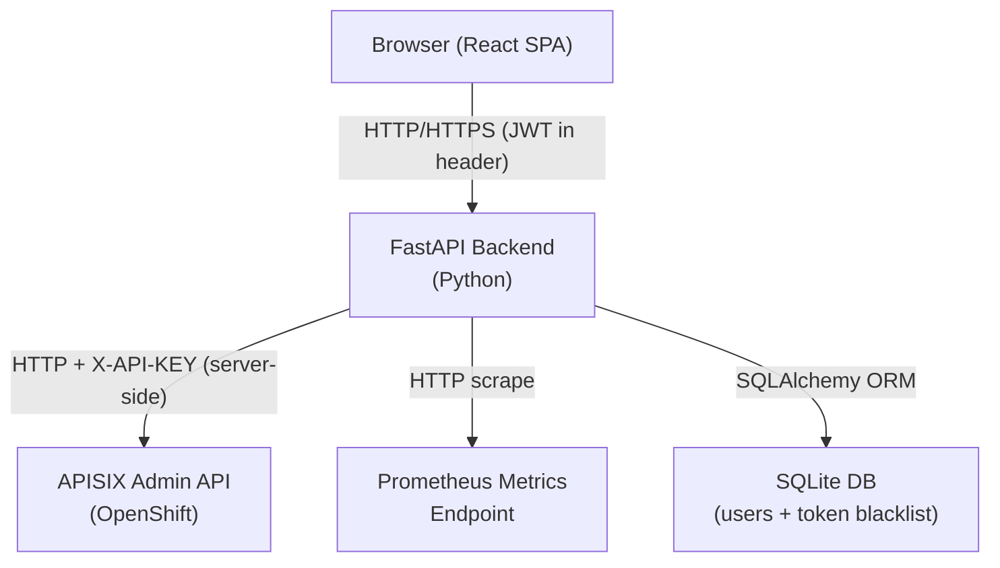
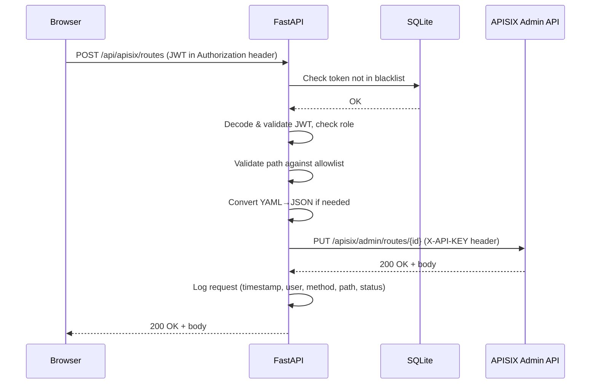

# Design Document: APISIX Dashboard

## Overview

The APISIX Dashboard is a standalone web application that provides a management UI for Apache APISIX 3.x running on OpenShift. It replaces the default APISIX Dashboard with a custom interface that matches the Fircosoft Dashboard's technology patterns.

The application is split into two independently deployable units:

- **Backend** — a Python FastAPI service that proxies all APISIX Admin API calls, handles JWT authentication, parses Prometheus metrics, and converts YAML↔JSON payloads.
- **Frontend** — a React + Vite single-page application that communicates exclusively with the FastAPI backend; it never contacts the APISIX Admin API directly.

All sensitive credentials (Admin API key, JWT secret, metrics endpoint URL) live in server-side environment variables and are never transmitted to the browser.

### Key Design Decisions

| Decision | Choice | Rationale |
|---|---|---|
| Backend framework | FastAPI + Uvicorn | Matches existing Fircosoft patterns; async-native; auto-generates OpenAPI docs |
| Auth tokens | JWT (python-jose) + SQLite blacklist | Stateless tokens with server-side revocation on logout |
| Password hashing | passlib bcrypt | Industry standard; matches existing Fircosoft auth |
| APISIX proxy | httpx async client | Non-blocking; supports HTTPS with configurable cert verification |
| YAML↔JSON | PyYAML | Pure Python; no native dependencies; already in stack |
| Frontend editor | Monaco Editor (via `@monaco-editor/react`) | VS Code-quality syntax highlighting; supports YAML and JSON; widely used |
| Charts | Recharts | React-native; lightweight; composable |
| Frontend routing | React Router v6 | Standard SPA routing |
| Styling | Tailwind CSS | Matches Fircosoft Dashboard patterns |
| Database | SQLite via SQLAlchemy | Zero-infrastructure; sufficient for user store and token blacklist |
| OpenShift deployment | Dockerfile (backend) + nginx (frontend static) | Standard containerisation pattern |

---

## Architecture

The system follows a three-tier architecture: browser → FastAPI backend → APISIX Admin API.



### Request Flow — Authenticated Proxy Call



### Project Directory Structure

```
UAT/
├── backend/
│   ├── app/
│   │   ├── main.py                  # FastAPI app factory, CORS, startup hooks
│   │   ├── config.py                # Pydantic Settings (reads .env)
│   │   ├── database.py              # SQLAlchemy engine + session factory
│   │   ├── models/
│   │   │   ├── user.py              # User ORM model
│   │   │   └── token_blacklist.py   # TokenBlacklist ORM model
│   │   ├── schemas/
│   │   │   ├── auth.py              # Pydantic request/response schemas
│   │   │   └── apisix.py            # Pydantic schemas for APISIX payloads
│   │   ├── routers/
│   │   │   ├── auth.py              # /api/auth/* endpoints
│   │   │   ├── proxy.py             # /api/apisix/* proxy endpoints
│   │   │   └── metrics.py           # /api/metrics endpoint
│   │   ├── services/
│   │   │   ├── auth_service.py      # JWT creation, validation, blacklist
│   │   │   ├── proxy_service.py     # httpx client, path allowlist, YAML conv.
│   │   │   └── metrics_service.py   # Prometheus scrape + parse
│   │   └── utils/
│   │       ├── yaml_converter.py    # YAML↔JSON helpers
│   │       └── pem_validator.py     # PEM certificate validation
│   ├── tests/
│   │   ├── test_auth.py
│   │   ├── test_proxy.py
│   │   ├── test_metrics.py
│   │   └── test_yaml_converter.py
│   ├── .env.example
│   ├── requirements.txt
│   └── Dockerfile
├── frontend/
│   ├── src/
│   │   ├── main.jsx
│   │   ├── App.jsx                  # React Router root
│   │   ├── api/
│   │   │   └── client.js            # Axios instance with JWT interceptor
│   │   ├── pages/
│   │   │   ├── Login.jsx
│   │   │   ├── Routes.jsx
│   │   │   ├── Services.jsx
│   │   │   ├── Upstreams.jsx
│   │   │   ├── Consumers.jsx
│   │   │   ├── Plugins.jsx
│   │   │   ├── SSL.jsx
│   │   │   └── Monitoring.jsx
│   │   ├── components/
│   │   │   ├── Layout.jsx           # Sidebar + topbar shell
│   │   │   ├── ResourceTable.jsx    # Generic paginated table
│   │   │   ├── ResourceEditor.jsx   # Monaco editor + YAML/JSON toggle
│   │   │   ├── ConfirmDialog.jsx    # Delete confirmation modal
│   │   │   ├── MetricsChart.jsx     # Recharts CPU/memory charts
│   │   │   └── CertWarning.jsx      # Expiry warning badge
│   │   ├── hooks/
│   │   │   ├── useAuth.js
│   │   │   └── useMetrics.js
│   │   └── store/
│   │       └── authStore.js         # Zustand auth state
│   ├── public/
│   ├── index.html
│   ├── vite.config.js
│   ├── tailwind.config.js
│   └── package.json
├── nginx/
│   └── nginx.conf                   # Serves frontend static files + proxies /api
└── docker-compose.yml               # Local development orchestration
```

---

## Components and Interfaces

### Backend Components

#### 1. Config (`app/config.py`)

Uses `pydantic-settings` to load all configuration from environment variables. No defaults for secrets.

```python
class Settings(BaseSettings):
    # Auth
    JWT_SECRET: str
    JWT_ALGORITHM: str = "HS256"
    JWT_EXPIRY_MINUTES: int = 30

    # APISIX Admin API
    APISIX_ADMIN_BASE_URL: str          # e.g. https://apisix-admin.example.com
    APISIX_ADMIN_KEY: str
    APISIX_ADMIN_VERIFY_SSL: bool = True

    # Metrics
    APISIX_METRICS_URL: str

    # Database
    DATABASE_URL: str = "sqlite:///./apisix_dashboard.db"

    class Config:
        env_file = ".env"
```

#### 2. Auth Router (`routers/auth.py`)

| Endpoint | Method | Description |
|---|---|---|
| `/api/auth/login` | POST | Accepts `{username, password}`, returns `{access_token, token_type}` |
| `/api/auth/logout` | POST | Adds current token JTI to blacklist |
| `/api/auth/me` | GET | Returns current user info and role |

#### 3. Proxy Router (`routers/proxy.py`)

Catches all requests matching `/api/apisix/{resource_type}/{path:path}` and forwards them to the APISIX Admin API after:
1. JWT validation + blacklist check
2. Role enforcement (viewer → GET only)
3. Path allowlist validation
4. YAML→JSON conversion (if `Content-Type: application/yaml`)
5. Credential injection (`X-API-KEY` header)

**Allowed resource types (allowlist):**
`routes`, `services`, `upstreams`, `consumers`, `plugins`, `ssl`, `global_rules`, `plugin_metadata`

#### 4. Metrics Router (`routers/metrics.py`)

| Endpoint | Method | Description |
|---|---|---|
| `/api/metrics` | GET | Fetches, parses, and returns structured CPU/memory metrics |

#### 5. Auth Service (`services/auth_service.py`)

- `create_access_token(data: dict) -> str` — signs JWT with JTI claim
- `verify_token(token: str) -> dict` — decodes and validates JWT; checks blacklist
- `authenticate_user(username, password) -> User | None` — bcrypt verify
- `blacklist_token(jti: str)` — inserts JTI into `token_blacklist` table
- `seed_admin()` — called on startup; creates `admin` user if table is empty

#### 6. Proxy Service (`services/proxy_service.py`)

- `ALLOWED_RESOURCES: frozenset` — the path allowlist
- `forward_request(method, resource_type, path, body, headers) -> Response` — async httpx call
- `convert_yaml_body(body: bytes, content_type: str) -> tuple[bytes, str]` — YAML→JSON if needed

#### 7. Metrics Service (`services/metrics_service.py`)

- `fetch_metrics() -> str` — async httpx GET to `APISIX_METRICS_URL`
- `parse_prometheus(text: str) -> list[PodMetrics]` — parses Prometheus text format, extracts `container_cpu_usage_seconds_total` and `container_memory_working_set_bytes` per pod label

#### 8. YAML Converter (`utils/yaml_converter.py`)

- `yaml_to_json(yaml_str: str) -> str` — PyYAML load → json.dumps
- `json_to_yaml(json_str: str) -> str` — json.loads → PyYAML dump
- Both raise `ValueError` on parse failure

#### 9. PEM Validator (`utils/pem_validator.py`)

- `validate_pem_cert(pem: str) -> bool` — checks for `-----BEGIN CERTIFICATE-----` header/footer
- `validate_pem_key(pem: str) -> bool` — checks for `-----BEGIN.*PRIVATE KEY-----` header/footer

### Frontend Components

#### API Client (`api/client.js`)

Axios instance configured with:
- `baseURL` pointing to the FastAPI backend
- Request interceptor: attaches `Authorization: Bearer <token>` from auth store
- Response interceptor: redirects to `/login` on 401

#### Auth Store (`store/authStore.js`)

Zustand store holding `{ token, user, role }`. Persisted to `sessionStorage`.

#### ResourceEditor Component

Wraps `@monaco-editor/react` with:
- Language toggle: YAML ↔ JSON
- On toggle: calls backend `/api/util/convert` or performs client-side conversion
- Inline error markers from Monaco's built-in YAML/JSON validation
- Submit disabled while editor has errors

#### MetricsChart Component

Recharts `LineChart` or `AreaChart` displaying:
- CPU usage (%) per pod over time (rolling 10-point window)
- Memory usage (MB) per pod over time
- Auto-refreshes via `useMetrics` hook at configurable interval (default 30 s)

---

## Data Models

### SQLite Tables (SQLAlchemy ORM)

#### `users`

| Column | Type | Constraints |
|---|---|---|
| `id` | INTEGER | PK, autoincrement |
| `username` | VARCHAR(64) | UNIQUE, NOT NULL |
| `hashed_password` | VARCHAR(128) | NOT NULL |
| `role` | VARCHAR(16) | NOT NULL, CHECK IN ('viewer','admin') |
| `is_active` | BOOLEAN | NOT NULL, DEFAULT TRUE |
| `created_at` | DATETIME | NOT NULL, DEFAULT now() |

#### `token_blacklist`

| Column | Type | Constraints |
|---|---|---|
| `id` | INTEGER | PK, autoincrement |
| `jti` | VARCHAR(64) | UNIQUE, NOT NULL, INDEX |
| `invalidated_at` | DATETIME | NOT NULL, DEFAULT now() |
| `expires_at` | DATETIME | NOT NULL |

The `expires_at` column allows a background cleanup job to purge expired entries, keeping the blacklist table small.

### Pydantic Schemas

#### Auth Schemas

```python
class LoginRequest(BaseModel):
    username: str
    password: str

class TokenResponse(BaseModel):
    access_token: str
    token_type: str = "bearer"

class UserInfo(BaseModel):
    username: str
    role: Literal["viewer", "admin"]
```

#### APISIX Proxy Schemas

```python
class ProxyRequest(BaseModel):
    # Used for structured validation of route/service/upstream payloads
    # Actual validation is delegated to the Admin API; proxy does structural checks only
    pass

class ProxyError(BaseModel):
    detail: str
    status_code: int
```

#### Metrics Schemas

```python
class PodMetrics(BaseModel):
    pod: str
    cpu_usage: float       # seconds (raw Prometheus counter)
    memory_bytes: int      # bytes

class MetricsResponse(BaseModel):
    timestamp: datetime
    pods: list[PodMetrics]
```

### JWT Payload Structure

```json
{
  "sub": "admin",
  "role": "admin",
  "jti": "uuid4-string",
  "exp": 1700000000,
  "iat": 1699998200
}
```

The `jti` (JWT ID) claim is a UUID4 generated at token creation time. It is stored in the `token_blacklist` table on logout.

---

## Correctness Properties

*A property is a characteristic or behavior that should hold true across all valid executions of a system — essentially, a formal statement about what the system should do. Properties serve as the bridge between human-readable specifications and machine-verifiable correctness guarantees.*

### Property Reflection

Before listing properties, redundancies were eliminated:

- Requirements 2.2 and 2.3 both describe viewer role enforcement at the proxy level — consolidated into **Property 4**.
- Requirements 1.4 and 2.5 both describe token/auth rejection — kept separate because 1.4 is about valid token acceptance and 2.5 is about missing auth.
- Requirements 4.3, 5.3, 6.3, 7.3 all describe schema validation returning 422 — consolidated into **Property 8** (generic validation property).
- Requirements 11.2 and 11.3 both relate to YAML↔JSON conversion — consolidated into **Property 12**.

---

### Property 1: Valid credentials always produce a decodable JWT

*For any* registered user with a valid username and bcrypt-hashed password, submitting those credentials to the login endpoint SHALL return a JWT that can be decoded with the configured secret and contains the correct `sub` and `role` claims.

**Validates: Requirements 1.1**

---

### Property 2: Invalid credentials never produce a token

*For any* credential pair where the username does not exist or the password does not match the stored hash, the login endpoint SHALL return HTTP 401 and the response body SHALL NOT contain an `access_token` field.

**Validates: Requirements 1.2**

---

### Property 3: Passwords are always stored as bcrypt hashes

*For any* password string submitted during user creation, the value stored in the `hashed_password` column SHALL be a valid bcrypt hash (verifiable with `bcrypt.checkpw`) and SHALL NOT equal the plaintext password.

**Validates: Requirements 1.3**

---

### Property 4: Viewer role blocks all non-GET requests

*For any* authenticated user with role `viewer` and *any* non-GET HTTP method (POST, PUT, PATCH, DELETE) targeting any allowed resource path, the Admin_API_Proxy SHALL return HTTP 403 and SHALL NOT forward the request to the APISIX Admin API.

**Validates: Requirements 2.2, 2.3**

---

### Property 5: Admin role permits all CRUD operations

*For any* authenticated user with role `admin` and *any* valid HTTP method targeting any allowed resource path, the Admin_API_Proxy SHALL NOT return HTTP 403.

**Validates: Requirements 2.4**

---

### Property 6: Unauthenticated requests are always rejected

*For any* request to any protected endpoint that lacks a valid `Authorization` header, the Admin_API_Proxy SHALL return HTTP 401 before forwarding the request to the APISIX Admin API.

**Validates: Requirements 2.5, 1.5**

---

### Property 7: Proxy responses never contain sensitive credentials

*For any* proxied response (success or error), the response body and headers SHALL NOT contain the value of `APISIX_ADMIN_KEY` or `APISIX_ADMIN_BASE_URL`.

**Validates: Requirements 2.6, 12.2**

---

### Property 8: Invalid payloads always return 422 with field-level errors

*For any* resource payload (route, service, upstream, consumer, SSL) that fails structural validation, the Admin_API_Proxy SHALL return HTTP 422 and the response body SHALL contain at least one field-level error detail identifying the invalid field.

**Validates: Requirements 4.3, 5.3, 6.3, 7.3, 9.3**

---

### Property 9: Path allowlist is enforced for all requests

*For any* request path that does not begin with one of the eight allowed resource type prefixes (`routes`, `services`, `upstreams`, `consumers`, `plugins`, `ssl`, `global_rules`, `plugin_metadata`), the Admin_API_Proxy SHALL return HTTP 400 and SHALL NOT forward the request.

*For any* request path that does begin with an allowed resource type prefix, the Admin_API_Proxy SHALL NOT return HTTP 400 due to path validation.

**Validates: Requirements 3.4**

---

### Property 10: Non-2xx Admin API responses are forwarded unchanged

*For any* non-2xx HTTP status code returned by the APISIX Admin API, the Admin_API_Proxy SHALL forward that exact status code and the unmodified response body to the caller.

**Validates: Requirements 3.2**

---

### Property 11: Every proxied request produces a log entry with required fields

*For any* request that is forwarded to the APISIX Admin API, the logging subsystem SHALL produce a log entry containing: timestamp, authenticated username, HTTP method, resource path, and response status code.

**Validates: Requirements 3.5**

---

### Property 12: YAML↔JSON conversion is lossless (round-trip)

*For any* syntactically valid YAML document representing an APISIX resource, converting it to JSON and back to YAML SHALL produce a document that is semantically equivalent to the original (same keys and values, order-independent).

*For any* syntactically valid JSON document representing an APISIX resource, converting it to YAML and back to JSON SHALL produce a document that is semantically equivalent to the original.

**Validates: Requirements 11.2, 11.3**

---

### Property 13: Syntactically invalid YAML/JSON is always rejected before submission

*For any* string that is not valid YAML or not valid JSON (depending on the selected mode), the editor component SHALL raise a parse error and the submit action SHALL be disabled.

**Validates: Requirements 11.4**

---

### Property 14: Token logout invalidates the token for all subsequent requests

*For any* valid JWT token, after calling the logout endpoint with that token, any subsequent request to any protected endpoint using that same token SHALL return HTTP 401.

**Validates: Requirements 1.6**

---

### Property 15: SSL certificate expiry warning is shown for certs within 30 days

*For any* SSL certificate whose expiry date is within 30 days of the current date, the dashboard SHALL display a warning indicator. *For any* SSL certificate whose expiry date is more than 30 days away, no warning indicator SHALL be shown.

**Validates: Requirements 9.5**

---

### Property 16: Prometheus metrics parser extracts CPU and memory per pod

*For any* valid Prometheus text-format response containing `container_cpu_usage_seconds_total` and `container_memory_working_set_bytes` metrics with pod labels, the metrics parser SHALL return a list of `PodMetrics` objects where each pod label appears exactly once and the extracted values match the values in the source text.

**Validates: Requirements 10.2**

---

## Error Handling

### Backend Error Hierarchy

| Scenario | HTTP Status | Response Body |
|---|---|---|
| Invalid credentials | 401 | `{"detail": "Invalid username or password"}` |
| Missing/expired/blacklisted JWT | 401 | `{"detail": "Not authenticated"}` |
| Viewer attempting write | 403 | `{"detail": "Insufficient permissions"}` |
| Path not in allowlist | 400 | `{"detail": "Resource type not permitted: <type>"}` |
| Payload validation failure | 422 | FastAPI standard validation error body |
| Invalid PEM content | 422 | `{"detail": "Invalid PEM certificate/key format"}` |
| APISIX Admin API non-2xx | forwarded | Original APISIX error body + status |
| APISIX Admin API unreachable | 503 | `{"detail": "APISIX Admin API unreachable"}` |
| Metrics endpoint non-2xx | 502 | `{"detail": "Metrics endpoint returned <status>"}` |
| Metrics endpoint unreachable | 503 | `{"detail": "Metrics endpoint unreachable"}` |
| YAML parse error | 422 | `{"detail": "Invalid YAML: <parse error message>"}` |
| Internal server error | 500 | `{"detail": "Internal server error"}` (no stack trace in production) |

### Timeout Configuration

- APISIX Admin API calls: 10-second connect + read timeout (configurable via `APISIX_ADMIN_TIMEOUT` env var)
- Prometheus metrics scrape: 10-second connect + read timeout (configurable via `APISIX_METRICS_TIMEOUT` env var)

### Frontend Error Handling

- All API errors are caught by the Axios response interceptor
- 401 responses trigger automatic redirect to `/login` with session cleared
- 403 responses display an inline "Permission denied" toast notification
- 4xx/5xx responses display the `detail` field from the error body in a toast
- Network errors (no response) display "Cannot reach server — check your connection"

### Logging Strategy

The backend uses Python's standard `logging` module configured at startup:

- Log level: `INFO` in production, `DEBUG` in development (controlled by `LOG_LEVEL` env var)
- Format: `%(asctime)s | %(levelname)s | %(name)s | %(message)s`
- Sensitive values (`APISIX_ADMIN_KEY`, `JWT_SECRET`, passwords) are never passed to any logger
- Each proxied request logs: `PROXY | {username} | {method} | {path} | {status_code} | {duration_ms}ms`

---

## Testing Strategy

### Overview

The testing strategy uses a dual approach:
- **Unit/example tests** for specific behaviors, error conditions, and integration points
- **Property-based tests** for universal correctness properties across the input space

The property-based testing library is **[Hypothesis](https://hypothesis.readthedocs.io/)** (Python), configured with a minimum of 100 examples per property test (`settings(max_examples=100)`).

### Backend Tests

#### Unit / Example Tests (`tests/`)

| Test File | Coverage |
|---|---|
| `test_auth.py` | Login success/failure, token creation, bcrypt hashing, seed admin, logout flow |
| `test_proxy.py` | Path allowlist enforcement, role enforcement, APISIX error forwarding, timeout handling, credential non-exposure |
| `test_metrics.py` | Metrics fetch success, 502 on non-2xx, 503 on unreachable, Prometheus parse |
| `test_yaml_converter.py` | YAML→JSON, JSON→YAML, invalid input rejection |
| `test_pem_validator.py` | Valid cert/key acceptance, invalid PEM rejection |

#### Property-Based Tests (Hypothesis)

Each property test is tagged with a comment referencing the design property:
`# Feature: apisix-dashboard, Property {N}: {property_text}`

| Property | Test Description | Hypothesis Strategy |
|---|---|---|
| Property 1 | Valid credentials → decodable JWT | `st.from_model(User)` — generate registered users |
| Property 2 | Invalid credentials → 401, no token | `st.text()` pairs not matching any user |
| Property 3 | Passwords stored as bcrypt hashes | `st.text(min_size=1)` for passwords |
| Property 4 | Viewer blocks non-GET | `st.sampled_from(["POST","PUT","PATCH","DELETE"])` × allowed paths |
| Property 5 | Admin permits all CRUD | `st.sampled_from(HTTP_METHODS)` × allowed paths |
| Property 6 | No auth → 401 | `st.sampled_from(PROTECTED_ENDPOINTS)` |
| Property 7 | Responses never contain secrets | All proxied response scenarios |
| Property 8 | Invalid payloads → 422 | `st.fixed_dictionaries({})` with missing required fields |
| Property 9 | Path allowlist enforced | `st.text()` for arbitrary paths |
| Property 10 | Non-2xx forwarded unchanged | `st.integers(min_value=400, max_value=599)` for status codes |
| Property 11 | Every proxy call produces log entry | All proxy call scenarios |
| Property 12 | YAML↔JSON round-trip lossless | `st.recursive(...)` for nested dicts/lists |
| Property 13 | Invalid YAML/JSON rejected | `st.text()` filtered to syntactically invalid strings |
| Property 14 | Logout invalidates token | Valid token generation + logout + retry |
| Property 15 | SSL expiry warning threshold | `st.dates()` relative to today |
| Property 16 | Prometheus parser extracts correct values | Generated Prometheus text-format strings |

### Frontend Tests

- **Vitest + React Testing Library** for component unit tests
- **Snapshot tests** for `ResourceEditor`, `MetricsChart`, `CertWarning` rendering
- **Example-based tests** for `ResourceTable` pagination, `ConfirmDialog` flow, auth store state transitions
- No property-based tests on the frontend (UI rendering is not amenable to PBT)

### Integration Tests

- Start the FastAPI app with a test SQLite database and a mock APISIX Admin API (using `respx` for httpx mocking)
- Verify end-to-end flows: login → proxy call → logout
- Verify HTTPS certificate validation behaviour
- Run with `pytest --integration` marker (excluded from default test run)

### Test Configuration

```ini
# pytest.ini
[pytest]
testpaths = tests
markers =
    integration: marks tests as integration tests (deselect with '-m "not integration"')
```

```python
# conftest.py (excerpt)
from hypothesis import settings
settings.register_profile("ci", max_examples=100)
settings.register_profile("dev", max_examples=20)
settings.load_profile(os.getenv("HYPOTHESIS_PROFILE", "dev"))
```

---

## OpenShift Deployment

### Backend Dockerfile

```dockerfile
FROM python:3.11-slim
WORKDIR /app
COPY requirements.txt .
RUN pip install --no-cache-dir -r requirements.txt
COPY app/ ./app/
EXPOSE 8000
CMD ["uvicorn", "app.main:app", "--host", "0.0.0.0", "--port", "8000"]
```

### Frontend Build + nginx

The frontend is built with `npm run build` (Vite) producing a `dist/` directory. An nginx container serves the static files and proxies `/api` requests to the FastAPI backend:

```nginx
# nginx/nginx.conf
server {
    listen 8080;
    root /usr/share/nginx/html;
    index index.html;

    location /api/ {
        proxy_pass http://backend:8000;
        proxy_set_header Host $host;
        proxy_set_header X-Real-IP $remote_addr;
    }

    location / {
        try_files $uri $uri/ /index.html;
    }
}
```

### Environment Variables

| Variable | Required | Description |
|---|---|---|
| `JWT_SECRET` | Yes | Secret key for JWT signing (min 32 chars) |
| `APISIX_ADMIN_BASE_URL` | Yes | Base URL of APISIX Admin API |
| `APISIX_ADMIN_KEY` | Yes | APISIX Admin API key |
| `APISIX_METRICS_URL` | Yes | Prometheus metrics endpoint URL |
| `APISIX_ADMIN_VERIFY_SSL` | No | Set to `false` to skip TLS verification (default: `true`) |
| `APISIX_ADMIN_TIMEOUT` | No | Timeout in seconds for Admin API calls (default: `10`) |
| `APISIX_METRICS_TIMEOUT` | No | Timeout in seconds for metrics scrape (default: `10`) |
| `DATABASE_URL` | No | SQLAlchemy DB URL (default: `sqlite:///./apisix_dashboard.db`) |
| `LOG_LEVEL` | No | Python log level (default: `INFO`) |

### OpenShift Route Compatibility

The FastAPI app sets `root_path` from the `ROOT_PATH` environment variable to support reverse-proxy path prefixes. CORS origins are configured via the `CORS_ORIGINS` environment variable (comma-separated list). The app does not rely on `X-Forwarded-*` headers for security decisions.
