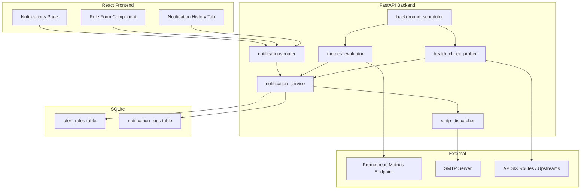
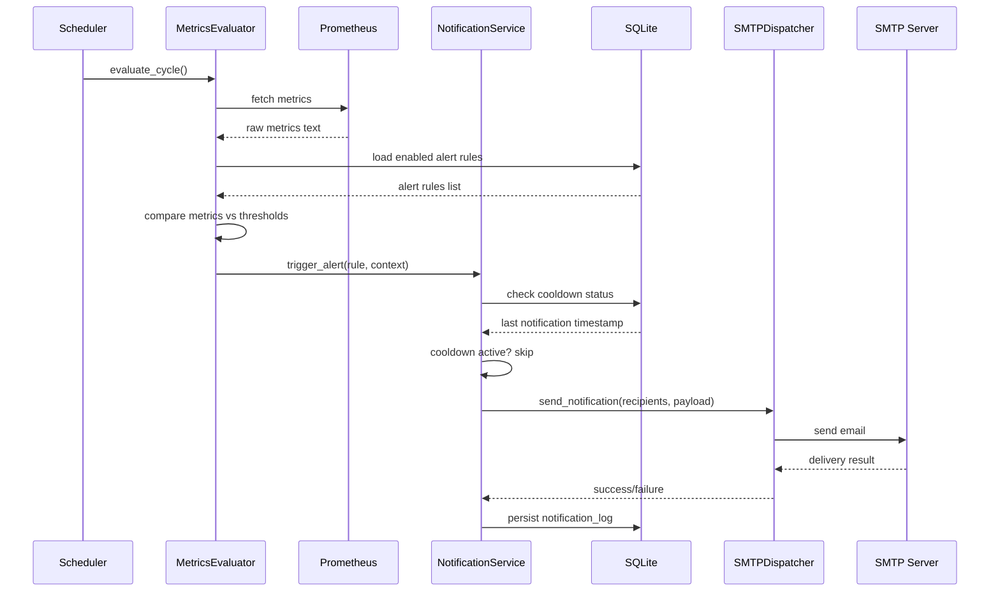

# Design Document: APISIX Route Email Notifications

## Overview

This design adds an email notification subsystem to the APISIX Dashboard. The system monitors route health via Prometheus metrics and active health-check probes, evaluates user-defined alert rules against those metrics on a configurable schedule, and dispatches email notifications through SMTP when thresholds are breached.

The architecture follows the existing project conventions: a new FastAPI router exposes REST endpoints, a new SQLAlchemy model persists alert rules and notification logs, and a background scheduler (using `asyncio` tasks within FastAPI's lifespan) drives periodic evaluation. The frontend gains a new React page with Tailwind CSS styling, consistent with the existing dashboard pages.

### Key Design Decisions

1. **asyncio-based scheduler over APScheduler** — The project already uses FastAPI lifespan events. An `asyncio.Task` with a sleep loop is simpler, has zero new dependencies, and integrates naturally with the existing shutdown logic.
2. **aiosmtplib for async SMTP** — Keeps the evaluation loop non-blocking. The only new backend dependency.
3. **Reuse existing metrics service** — The `metrics_service.parse_apisix_metrics()` function already parses per-route HTTP status data from Prometheus. The evaluator wraps this with threshold logic.
4. **SQLite storage for rules and logs** — Consistent with the existing database strategy. Alert rules and notification logs are low-volume data well-suited to SQLite.
5. **Health-check probes run in the same scheduler loop** — Probes are lightweight HTTP GETs; running them alongside metric evaluation avoids a second scheduler.

## Architecture



### Component Interaction Flow



## Components and Interfaces

### Backend Components

#### 1. `app/config.py` — Extended Settings

New environment variables added to the existing `Settings` class:

| Variable | Type | Default | Description |
|----------|------|---------|-------------|
| `SMTP_HOST` | str | `""` | SMTP server hostname |
| `SMTP_PORT` | int | `587` | SMTP server port |
| `SMTP_USERNAME` | str | `""` | SMTP auth username (optional) |
| `SMTP_PASSWORD` | str | `""` | SMTP auth password (optional) |
| `SMTP_FROM_ADDRESS` | str | `""` | Sender email address |
| `SMTP_USE_TLS` | bool | `True` | Use STARTTLS |
| `NOTIFICATION_EVAL_INTERVAL` | int | `60` | Seconds between evaluation cycles |
| `NOTIFICATION_LOG_RETENTION_DAYS` | int | `90` | Days to retain notification logs |

#### 2. `app/services/notification_service.py` — Core Orchestrator

```python
class NotificationService:
    """Orchestrates alert rule evaluation, cooldown management, and dispatch."""

    def should_notify(rule_id: int, db: Session) -> bool
    def trigger_alert(rule: AlertRule, context: AlertContext, db: Session) -> None
    def check_recovery(rule: AlertRule, context: AlertContext, db: Session) -> None
    def get_rules(db: Session, enabled_only: bool = True) -> list[AlertRule]
    def create_rule(data: AlertRuleCreate, db: Session) -> AlertRule
    def update_rule(rule_id: int, data: AlertRuleUpdate, db: Session) -> AlertRule
    def delete_rule(rule_id: int, db: Session) -> None
    def get_notification_logs(filters: LogFilters, db: Session) -> PaginatedLogs
    def purge_old_logs(db: Session) -> int
```

#### 3. `app/services/metrics_evaluator.py` — Threshold Logic

```python
class MetricsEvaluator:
    """Evaluates parsed metrics against alert rule thresholds."""

    def evaluate_jwt_failure(metrics: dict, rule: AlertRule) -> Optional[AlertContext]
    def evaluate_upstream_error(metrics: dict, rule: AlertRule) -> Optional[AlertContext]
    def evaluate_high_error_rate(metrics: dict, rule: AlertRule) -> Optional[AlertContext]
    def calculate_error_rate(metrics: dict, route_id: str) -> Optional[float]
```

#### 4. `app/services/smtp_dispatcher.py` — Email Delivery

```python
class SMTPDispatcher:
    """Handles email formatting and delivery with retry logic."""

    async def send_notification(recipients: list[str], subject: str, body: str) -> DeliveryResult
    async def send_test_email(recipient: str) -> DeliveryResult
    def format_alert_email(context: AlertContext) -> tuple[str, str]  # (subject, body)
    def format_recovery_email(context: AlertContext) -> tuple[str, str]
```

Retry strategy: 3 attempts with exponential backoff (2s, 4s, 8s).

#### 5. `app/services/health_check_prober.py` — Active Probing

```python
class HealthCheckProber:
    """Manages periodic HTTP health-check probes for configured routes."""

    def __init__(self):
        self._probe_state: dict[str, ProbeState] = {}

    async def probe_route(route_id: str, url: str) -> ProbeResult
    def update_state(route_id: str, result: ProbeResult) -> Optional[AlertContext]
    def get_state(route_id: str) -> ProbeState
```

#### 6. `app/services/background_scheduler.py` — Lifecycle Management

```python
class BackgroundScheduler:
    """Manages the periodic evaluation loop within FastAPI lifespan."""

    async def start() -> None
    async def stop(timeout: float = 30.0) -> None
    async def _run_cycle() -> None
    def is_running() -> bool
```

#### 7. `app/routers/notifications.py` — REST API

| Method | Path | Description |
|--------|------|-------------|
| `GET` | `/api/notifications/rules` | List alert rules (paginated) |
| `POST` | `/api/notifications/rules` | Create alert rule |
| `GET` | `/api/notifications/rules/{id}` | Get single rule |
| `PUT` | `/api/notifications/rules/{id}` | Update alert rule |
| `DELETE` | `/api/notifications/rules/{id}` | Delete alert rule |
| `PATCH` | `/api/notifications/rules/{id}/toggle` | Toggle enabled status |
| `GET` | `/api/notifications/logs` | Query notification logs |
| `POST` | `/api/notifications/test-email` | Send test email |
| `GET` | `/api/notifications/status` | Scheduler status |

All endpoints require JWT authentication via `get_current_user` dependency (admin role).

### Frontend Components

#### 8. `frontend/src/pages/Notifications.jsx` — Main Page

Two-tab layout:
- **Alert Rules** tab: Table of rules with create/edit/delete/toggle actions
- **Notification History** tab: Filterable, paginated log table

#### 9. `frontend/src/components/AlertRuleForm.jsx` — Rule CRUD Form

Modal form with fields: rule name, route selector (dropdown from existing routes), condition type, threshold, recipients (tag input), cooldown, enabled toggle. Inline validation before submission.

#### 10. `frontend/src/api/notifications.js` — API Client

Axios-based API client module for all notification endpoints.

## Data Models

### SQLAlchemy Models

#### `app/models/alert_rule.py`

```python
class AlertRule(Base):
    __tablename__ = "alert_rules"

    id = Column(Integer, primary_key=True, index=True)
    name = Column(String(128), unique=True, nullable=False, index=True)
    route_id = Column(String(200), nullable=False, index=True)
    route_name = Column(String(200), nullable=True)
    condition_type = Column(String(30), nullable=False)  # JWT_FAILURE, UPSTREAM_ERROR, HIGH_ERROR_RATE, HEALTH_CHECK_FAILURE
    threshold = Column(Integer, nullable=False)
    recipients = Column(Text, nullable=False)  # JSON array of email strings
    cooldown_seconds = Column(Integer, nullable=False, default=300)
    enabled = Column(Boolean, default=True, nullable=False)
    health_check_url = Column(String(500), nullable=True)  # For HEALTH_CHECK_FAILURE type
    health_check_interval = Column(Integer, nullable=True, default=60)
    health_check_failures_threshold = Column(Integer, nullable=True, default=3)
    created_at = Column(DateTime, default=lambda: datetime.now(timezone.utc), nullable=False)
    updated_at = Column(DateTime, default=lambda: datetime.now(timezone.utc), onupdate=lambda: datetime.now(timezone.utc), nullable=False)
```

#### `app/models/notification_log.py`

```python
class NotificationLog(Base):
    __tablename__ = "notification_logs"

    id = Column(Integer, primary_key=True, index=True)
    timestamp = Column(DateTime, default=lambda: datetime.now(timezone.utc), nullable=False, index=True)
    alert_rule_id = Column(Integer, ForeignKey("alert_rules.id", ondelete="SET NULL"), nullable=True)
    route_id = Column(String(200), nullable=False, index=True)
    route_name = Column(String(200), nullable=True)
    condition_type = Column(String(30), nullable=False, index=True)
    recipients = Column(Text, nullable=False)  # JSON array
    subject = Column(String(500), nullable=False)
    delivery_status = Column(String(20), nullable=False, index=True)  # SENT, FAILED, RETRYING
    error_message = Column(Text, nullable=True)
```

### Pydantic Schemas (`app/schemas/notifications.py`)

```python
class ConditionType(str, Enum):
    JWT_FAILURE = "JWT_FAILURE"
    UPSTREAM_ERROR = "UPSTREAM_ERROR"
    HIGH_ERROR_RATE = "HIGH_ERROR_RATE"
    HEALTH_CHECK_FAILURE = "HEALTH_CHECK_FAILURE"

class AlertRuleCreate(BaseModel):
    name: str  # 1-128 chars, alphanumeric + hyphens + underscores
    route_id: str
    condition_type: ConditionType
    threshold: int  # 1-10000 (count) or 1-100 (percentage)
    recipients: list[EmailStr]  # 1-10 addresses
    cooldown_seconds: int  # 60-86400
    enabled: bool = True
    health_check_url: Optional[str] = None
    health_check_interval: Optional[int] = 60  # 10-3600
    health_check_failures_threshold: Optional[int] = 3  # 1-10

class AlertRuleResponse(BaseModel):
    id: int
    name: str
    route_id: str
    route_name: Optional[str]
    condition_type: ConditionType
    threshold: int
    recipients: list[str]
    cooldown_seconds: int
    enabled: bool
    health_check_url: Optional[str]
    health_check_interval: Optional[int]
    health_check_failures_threshold: Optional[int]
    created_at: datetime
    updated_at: datetime

class NotificationLogResponse(BaseModel):
    id: int
    timestamp: datetime
    alert_rule_id: Optional[int]
    route_id: str
    route_name: Optional[str]
    condition_type: str
    recipients: list[str]
    subject: str
    delivery_status: str
    error_message: Optional[str]

class PaginatedLogs(BaseModel):
    items: list[NotificationLogResponse]
    total: int
    page: int
    page_size: int

class DeliveryStatus(str, Enum):
    SENT = "SENT"
    FAILED = "FAILED"
    RETRYING = "RETRYING"
```

### Internal Data Classes

```python
@dataclass
class AlertContext:
    """Context passed from evaluator to dispatcher when an alert triggers."""
    rule: AlertRule
    route_id: str
    route_name: str
    condition_type: str
    metric_values: dict  # e.g., {"401_count": 12, "403_count": 3}
    threshold: int
    evaluation_window_start: datetime
    evaluation_window_end: datetime
    is_recovery: bool = False

@dataclass
class ProbeState:
    """Tracks consecutive probe results for a route."""
    route_id: str
    consecutive_failures: int = 0
    consecutive_successes: int = 0
    last_probe_time: Optional[datetime] = None
    last_status: Optional[str] = None  # "healthy", "unhealthy"

@dataclass
class DeliveryResult:
    """Result of an email delivery attempt."""
    success: bool
    error_message: Optional[str] = None
    attempts: int = 1
```


## Correctness Properties

*A property is a characteristic or behavior that should hold true across all valid executions of a system — essentially, a formal statement about what the system should do. Properties serve as the bridge between human-readable specifications and machine-verifiable correctness guarantees.*

### Property 1: Alert rule validation accepts valid inputs and rejects invalid inputs

*For any* `AlertRuleCreate` payload, the notification service SHALL accept the payload if and only if: the name is 1–128 characters composed of alphanumeric characters, hyphens, and underscores; the threshold is within the valid range for the condition type (1–10000 for count-based, 1–100 for percentage-based); the recipients list contains 1–10 valid email addresses; and the cooldown is between 60 and 86400 seconds. All other payloads SHALL be rejected with field-specific error details.

**Validates: Requirements 2.1, 2.2, 2.3**

### Property 2: Alert rule pagination returns correct pages

*For any* set of N alert rules in the database and any requested page number and page size (max 100), the returned page SHALL contain at most `page_size` rules, and iterating through all pages SHALL yield exactly N total rules with no duplicates and no omissions.

**Validates: Requirements 2.7**

### Property 3: Count-based threshold evaluation triggers correctly

*For any* alert rule with a count-based condition (JWT_FAILURE or UPSTREAM_ERROR), and *for any* metrics containing status code counts for the target route, the evaluator SHALL trigger the alert if and only if the sum of the relevant status codes (401+403 for JWT_FAILURE, 502+503+504 for UPSTREAM_ERROR) meets or exceeds the configured threshold, and the total request count for the route is greater than zero.

**Validates: Requirements 3.1, 4.1**

### Property 4: Error rate calculation and threshold evaluation

*For any* route with at least 10 total responses in the evaluation window, the calculated error rate SHALL equal `(count_4xx + count_5xx) / total_responses * 100` rounded to two decimal places, and the HIGH_ERROR_RATE alert SHALL trigger if and only if this calculated rate is strictly greater than the configured threshold percentage.

**Validates: Requirements 5.1, 5.2**

### Property 5: Cooldown suppression prevents duplicate notifications

*For any* alert rule and *for any* pair of timestamps (last_notification_time, current_time), the notification service SHALL suppress a notification if and only if `current_time - last_notification_time < cooldown_seconds`. When the cooldown has elapsed and the condition still exceeds the threshold, the notification SHALL be sent.

**Validates: Requirements 3.3, 4.3, 4.4, 5.5, 6.5**

### Property 6: Alert email contains all required fields for condition type

*For any* `AlertContext` with a valid condition type, the formatted email body SHALL contain: the route name, route ID, evaluation window timestamps, and alert timestamp. Additionally, for JWT_FAILURE it SHALL contain the 401/403 count; for UPSTREAM_ERROR it SHALL contain counts broken down by 502, 503, and 504; for HIGH_ERROR_RATE it SHALL contain the error rate percentage, threshold value, and total request count.

**Validates: Requirements 3.2, 4.2, 5.4**

### Property 7: Health check probe result classification

*For any* HTTP response status code, the health check prober SHALL classify it as successful if and only if the status code is in the range 200–299. All other status codes, connection errors, DNS failures, and timeouts SHALL be classified as failures.

**Validates: Requirements 6.2**

### Property 8: Consecutive failure detection triggers at threshold

*For any* sequence of probe results for a route with a configured failure threshold N, the HEALTH_CHECK_FAILURE alert SHALL trigger if and only if the last N consecutive probes all failed. Any success in the sequence resets the consecutive failure counter to zero.

**Validates: Requirements 6.3**

### Property 9: Health check recovery detection after consecutive successes

*For any* route in a "unhealthy" state (previously triggered HEALTH_CHECK_FAILURE), a recovery notification SHALL be sent if and only if the last 2 consecutive probes returned success (2xx). A single success followed by a failure SHALL NOT trigger recovery.

**Validates: Requirements 6.4**

### Property 10: Upstream recovery detection

*For any* route that previously triggered an UPSTREAM_ERROR alert, when the combined 502+503+504 count returns to or below the configured threshold in a subsequent evaluation window, the notification service SHALL send a recovery notification to the rule's recipients.

**Validates: Requirements 4.6**

### Property 11: Notification log record completeness

*For any* notification dispatch attempt (successful or failed), the persisted `NotificationLog` record SHALL contain all required fields: timestamp, alert_rule_id, route_id, route_name, condition_type, recipients, subject, delivery_status, and error_message (non-null when delivery_status is FAILED).

**Validates: Requirements 7.1**

### Property 12: Notification log filtering returns only matching records

*For any* combination of filter criteria (route_id, condition_type, date_range, delivery_status) applied to a set of notification logs, the returned results SHALL include only records that match ALL specified filters, and SHALL include every record that matches all filters.

**Validates: Requirements 7.2**

### Property 13: Log purge removes exactly expired records

*For any* set of notification logs with varying timestamps and a configured retention period of D days, the purge operation SHALL delete all records with `timestamp < now - D days` and SHALL retain all records with `timestamp >= now - D days`.

**Validates: Requirements 7.3**

## Error Handling

### SMTP Errors

| Scenario | Behavior |
|----------|----------|
| SMTP server unreachable | Retry 3× with exponential backoff (2s, 4s, 8s), then log permanent failure |
| SMTP authentication failure | Log error, mark delivery as FAILED, do not retry (auth errors are not transient) |
| SMTP timeout (>10s) | Treat as unreachable, apply retry logic |
| Invalid recipient address rejected by server | Log FAILED for that recipient, continue with remaining recipients |

### Metrics Fetch Errors

| Scenario | Behavior |
|----------|----------|
| Prometheus endpoint unreachable | Log error, skip entire evaluation cycle, resume next cycle |
| Prometheus returns non-200 | Log warning with status code, skip cycle |
| Metrics parse failure | Log error with raw text sample, skip cycle |
| No data for specific route | Skip that route's evaluation, log at DEBUG level |

### Health Check Probe Errors

| Scenario | Behavior |
|----------|----------|
| DNS resolution failure | Mark probe as failed, increment consecutive failure counter |
| Connection timeout (>10s) | Mark probe as failed |
| Non-2xx response | Mark probe as failed |
| Network error (connection reset, etc.) | Mark probe as failed |

### Scheduler Errors

| Scenario | Behavior |
|----------|----------|
| Evaluation cycle exceeds interval | Skip next cycle, log warning about overlap |
| Unhandled exception in evaluation | Log error with traceback, skip cycle, do not crash scheduler |
| Shutdown requested during evaluation | Allow up to 30s for completion, then force stop |

### API Validation Errors

| Scenario | HTTP Status | Response |
|----------|-------------|----------|
| Invalid field values | 422 | `{"detail": [{"field": "name", "message": "..."}]}` |
| Route not found | 404 | `{"detail": "Route not found: {route_id}"}` |
| Duplicate rule name | 409 | `{"detail": "Rule name already exists: {name}"}` |
| Rule not found | 404 | `{"detail": "Alert rule not found"}` |
| SMTP not configured | 503 | `{"detail": "Email notifications not configured"}` |

## Testing Strategy

### Property-Based Tests (Hypothesis)

The project already includes `hypothesis==6.122.0` in `requirements.txt`. Each correctness property maps to a single Hypothesis test with a minimum of 100 examples.

**Library:** Hypothesis (already installed)
**Configuration:** `@settings(max_examples=100)` minimum per property test
**Tag format:** `# Feature: apisix-route-email-notifications, Property {N}: {title}`

Property tests target the pure logic layer:
- `metrics_evaluator.py` — threshold comparison, error rate calculation
- `notification_service.py` — cooldown logic, validation logic
- `health_check_prober.py` — probe state machine (consecutive failures/successes)
- `smtp_dispatcher.py` — email formatting (content verification)
- Log filtering and purge logic

### Unit Tests (pytest)

Example-based tests for:
- SMTP retry behavior with mocked server (exact timing verification)
- Scheduler overlap detection
- Startup behavior with/without SMTP config
- API endpoint response codes and shapes
- Route existence validation
- Edge cases: zero requests, missing metrics, empty evaluation windows

### Integration Tests (pytest + respx)

- Full evaluation cycle with mocked Prometheus and SMTP
- API endpoint integration with database (create → list → update → delete)
- Health check probe with mocked HTTP targets
- Notification log persistence after dispatch

### Frontend Tests (Vitest + React Testing Library)

- Component rendering with mock data
- Form validation (inline errors)
- API error handling (error messages displayed, form data preserved)
- Navigation and tab switching
- Confirmation dialogs on delete

### Test File Structure

```
backend/
  tests/
    test_notification_service.py      # Unit + property tests for service logic
    test_metrics_evaluator.py         # Property tests for threshold/rate logic
    test_smtp_dispatcher.py           # Unit tests for retry + property tests for formatting
    test_health_check_prober.py       # Property tests for probe state machine
    test_notifications_router.py      # Integration tests for API endpoints
    test_background_scheduler.py      # Unit tests for scheduler lifecycle

frontend/
  src/
    pages/__tests__/
      Notifications.test.jsx          # Page rendering and interaction tests
    components/__tests__/
      AlertRuleForm.test.jsx          # Form validation and submission tests
```
